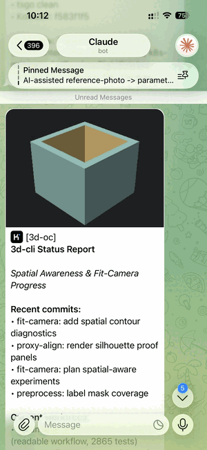
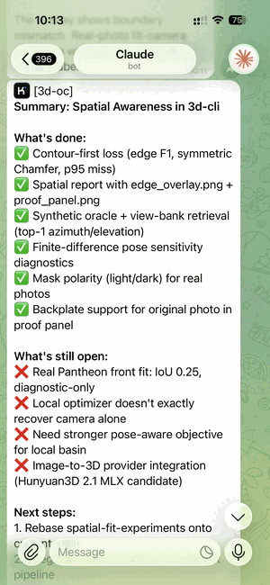
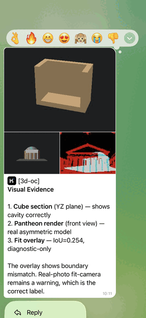

# tg-cli

> **Built for AI agents.** When you run `tg` inside a tmux session, it auto-detects which AI model is running (Kimi, Claude, Codex, Gemini, etc.) and prefixes every Telegram message with the corresponding custom emoji. No manual configuration — the icon just appears.

## Installation

1. Clone the repo:
   ```bash
   git clone git@github.com:alex-mextner/tg-cli.git
   cd tg-cli
   ```

2. Create config:
   ```bash
   mkdir -p ~/.config/tg-cli
   cp .env.example ~/.config/tg-cli/.env
   # edit ~/.config/tg-cli/.env with your bot token and chat ID
   ```

3. Add to PATH (symlink or copy):
   ```bash
   ln -sf "$(pwd)/tg" ~/.local/bin/tg
   ```

## Requirements

- [Bun](https://bun.sh) — `#!/usr/bin/env bun`

## Config

Place your credentials in `~/.config/tg-cli/.env`:

```
TG_BOT_TOKEN=<your bot token from @BotFather>
TG_CHAT_ID=<your chat or user ID>
```

## Usage

```bash
# Send a text message (auto-detects AI model, adds custom emoji prefix)
tg "Hello from the terminal"

# Send formatted HTML (auto-detected if tags present)
tg --format html "<b>Status</b>\nDone"
tg "<b>Auto-detected</b> HTML tags"  # same as --format html

# Send with custom emoji helpers
# (AI model auto-detected from running process)
tg "Hello :kimi: from the terminal"

# Send a photo
tg --photo screenshot.png

# Send a photo with caption
tg --photo screenshot.png "Look at this"

# Send a photo with HTML caption and custom emoji
tg --format html --photo diagram.png "<b>Report</b> :hyperide:"

# Send a file
tg --file report.pdf

# Send a file with caption
tg --file report.pdf "Monthly report"

# Send multiple photos with caption
tg --photo a.png --photo b.png "Two screenshots"

# Send multiple files
tg --file a.pdf --file b.pdf

# Mix photos and files
tg --photo diagram.png --file data.csv "Diagram and data"

# List all emoji helpers
tg --ls-emoji-helpers
```

Message text and captions decode `\n`, `\r`, `\t`, and `\\` into real newlines, carriage
returns, tabs, and backslashes. File paths are not decoded.

## Custom Emoji System

The CLI auto-detects your AI model from the running process and sends custom emoji icons.
Everything works automatically — no manual configuration needed.

### Auto-detected models

 <b>Kimi</b> — Moonshot AI<br/>
 <b>Claude</b> — Anthropic<br/>
 <b>Codex</b> — OpenAI<br/>
 <b>Gemini</b> — Google<br/>
 <b>DeepSeek</b><br/>
 <b>Qwen</b> — Alibaba<br/>
 <b>Mistral</b><br/>
 <b>Grok</b> — xAI<br/>
 <b>Copilot</b> — GitHub<br/>
 <b>Perplexity</b><br/>
 <b>Cursor</b><br/>
 <b>Windsurf</b><br/>
 <b>Ollama</b><br/>
 <b>HyperIDE</b><br/>

### How it works

When you run `tg` inside a tmux pane, it:
1. Detects the current AI model from process list (opencode, codex, aider, etc.)
2. Looks up the custom emoji ID for that model
3. Sends a `custom_emoji` entity alongside your message
4. Telegram displays the model's branded icon instead of plain text

### Emoji helpers

You can also manually insert any model's emoji:

```bash
tg "Testing :codex: and :gemini: side by side"
tg --format html "<b>Models:</b> :claude: :deepseek: :qwen:"
```

### Advanced: environment overrides

Everything works automatically. Manual overrides are rarely needed:

```bash
# Override the detected model
TG_AI_MODEL=kimi tg "message"

# Override a specific emoji ID
TG_EMOJI_ID_kimi=1234567890123456789 tg "message"
```

See [docs/custom-emoji-system.md](docs/custom-emoji-system.md) for the full specification.

## HTML Auto-detection

If `--format` is omitted but the text contains HTML tags (`<b>`, `<i>`, `<code>`, etc.), `parse_mode=HTML` is automatically enabled. This means you can write:

```bash
tg "<b>Important</b>: deployment complete"
```

Instead of:

```bash
tg --format html "<b>Important</b>: deployment complete"
```

## Screenshots

<table align="center" width="100%">
  <tr>
    <td align="center" width="33%">
      
      <br/>
      <sub><b>Status report</b> — HTML + custom emoji</sub>
    </td>
    <td align="center" width="33%">
      
      <br/>
      <sub><b>Visual evidence</b> — 3 photos + caption</sub>
    </td>
    <td align="center" width="33%">
      
      <br/>
      <sub><b>Summary</b> — structured findings</sub>
    </td>
  </tr>
</table>

## Ecosystem

Part of the [HyperIDE.ai](https://hyperide.ai) agent toolchain:

- **[draw-cli](https://github.com/alex-mextner/draw-cli)** — text-to-image via Hugging Face
- **[review-cli](https://github.com/alex-mextner/review-cli)** — multi-model read-only code review
- **[3d-cli](https://github.com/alex-mextner/3d-cli)** — scriptable CLI for the full 3D FDM lifecycle: modeling, mesh repair, slicing, and print monitoring
- **[hyperide.ai](https://hyperide.ai)** — Figma replacement inside VS Code. Edit React components directly through AST/LSP without AI hallucinations, token waste, or context-window limits. Works for indie vibe-coding and for enterprise teams with split design/dev roles.

## License

MIT
